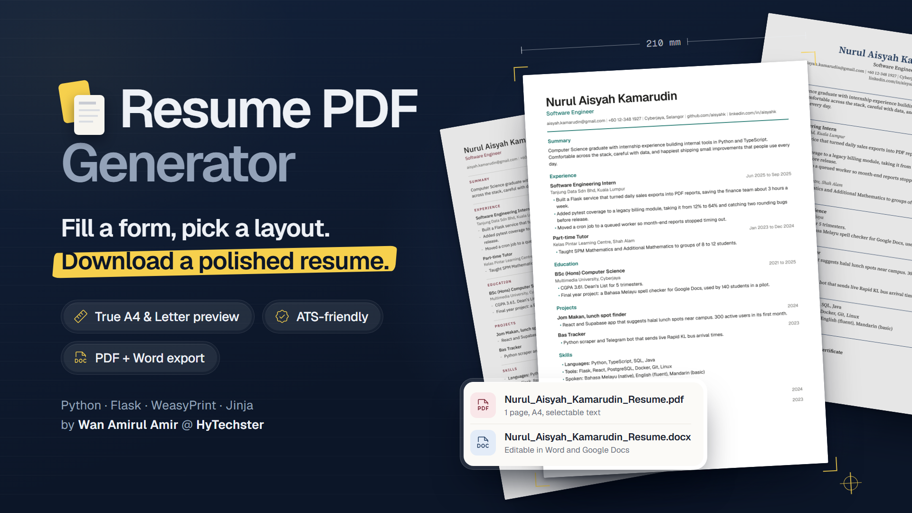

# Resume PDF Generator



A small web app that turns a form (or a Markdown document) into a clean, ATS-friendly resume.
Pick one of three layouts, tweak colour and alignment, preview the real pages, and download as PDF or Word.

No database, no accounts. Nothing the user types is stored on the server or written to disk.
The only persistence is a draft kept in the user's own browser (`localStorage`).

## Features

- **Two ways to write:** a guided form (entry cards for roles, education, projects, certificates, and skill rows)
  or a single Markdown document.
- **No syntax needed in the form:** headings, bullets and bold labels are added automatically.
- **Three print layouts:** `classic` (serif), `modern` (sans with an accent colour), `minimal` (airy, thin rules).
  All are single column with real, selectable text.
- **Style options:** formal colours only, name and section title alignment, left or justified paragraphs,
  dates on the heading line (right-aligned, grey) or under the title, A4 or Letter.
- **True page preview:** the preview shows the actual PDF pages as A4 or Letter sheets, so page breaks
  match the download exactly. It warns when the resume runs past one page.
- **Live settings:** the preview re-renders as soon as a setting changes.
- **PDF or Word:** download a PDF, or a `.docx` built from the same content with the same layout choices
  (dates on a right-aligned tab stop, real bullet lists, section rules).
- **Safe by default:** raw HTML in input is escaped, and the PDF renderer can only load files from `static/`,
  so user input cannot make the server fetch remote URLs.

## Why Flask

This app is a handful of routes that render HTML forms and return a file. Flask fits that shape closely:

- **Jinja is already the core of the product.** The resume layouts are Jinja templates rendered to HTML for
  WeasyPrint. Flask uses Jinja for its web pages too, so the website and the printed document share one
  template engine and one escaping model.
- **Nothing to switch off.** There is no database, no user accounts and no admin area, so Django's ORM,
  auth and admin would be dead weight. Flask adds only routing, request parsing and responses.
- **It is an HTML app, not a JSON API.** Frameworks like FastAPI shine at typed JSON APIs and async I/O.
  Here the work is server-rendered forms plus CPU-bound PDF rendering (WeasyPrint is synchronous),
  so async buys nothing.
- **The whole flow fits in a few short files.** `request.form.getlist()` handles the repeatable form fields,
  and `send_file(BytesIO(...))` streams the PDF or Word file from memory. `app.py` is about 130 lines.
- **Easy to run and deploy.** It is a plain WSGI app: `flask run` in development, Gunicorn or similar in production.

## Requirements

- Python 3.12 or newer
- Pango (a system library WeasyPrint uses to lay out text)
- On Windows, use **WSL** (Ubuntu). WeasyPrint is much easier to install there than on native Windows.

## Install

### Linux (Ubuntu / Debian, including WSL)

```bash
sudo apt update
sudo apt install python3-venv libpango-1.0-0 libpangoft2-1.0-0 libharfbuzz-subset0

git clone <repo-url> resume-pdf
cd resume-pdf
python3 -m venv .venv
source .venv/bin/activate
pip install -r requirements.txt
```

`libharfbuzz-subset0` is optional. Without it WeasyPrint still works but logs a warning about font subsetting.

### macOS

```bash
brew install pango
python3 -m venv .venv
source .venv/bin/activate
pip install -r requirements.txt
```

### Windows

Install WSL with Ubuntu (`wsl --install` in an admin PowerShell), open the Ubuntu terminal, and follow the
Linux steps. If the project lives on a Windows drive, it is under `/mnt/<drive letter>/...`, for example
`cd "/mnt/f/NEXT LIFE/Resume PDF Generator"`.

## Run

```bash
source .venv/bin/activate
flask --app app run --debug
```

Open http://localhost:5000. The same address works from a Windows browser when the app runs in WSL.

## Test

```bash
pytest
```

The tests cover Markdown parsing, form mapping, empty sections being dropped, HTML escaping, the style
whitelist, the local-only URL fetcher, the routes, the page preview images, the Word export, and that the
sample resume fits on one page in every template at A4 and Letter.

## Configuration

| Setting | Where | Notes |
|---|---|---|
| `SECRET_KEY` | environment variable | Set it in production. If missing, a random key is generated at startup. |
| `MAX_CONTENT_LENGTH` | `app.py` | 200 KB. Requests above this get a friendly error, and the browser draft refills the form. |

## Project structure

```
app.py                  Flask app and the routes
resume.py               form fields or Markdown -> Resume dataclass
render.py               Resume + template + style -> HTML -> PDF bytes, plus page images for the preview
render_docx.py          Resume + template + style -> Word (.docx) bytes
templates/              web UI (Jinja): base, form, preview, shared settings controls
resume_templates/       print layouts, one folder each (resume.html + style.css), plus shared.css
static/css/app.css      web UI styles and design tokens (light and dark mode)
static/js/app.js        draft save/restore, add/remove entries, sample loader, live preview
static/fonts/           self-hosted .woff2 fonts used by the UI and the PDFs
static/img/             template thumbnails shown in the picker
samples/sample.md       example resume in the Markdown format
tests/test_resume.py    pytest suite
```

## How it works

```
form fields  --+
               +--> resume.py --> Resume(name, headline, contacts, sections[title, html])
Markdown     --+                        |
                                        +--> render.py: Jinja layout + CSS + Style --> HTML
                                        |        |
                                        |        +--> WeasyPrint --> PDF bytes --> /pdf
                                        |                  |
                                        |                  +--> pypdfium2 --> page images --> /preview
                                        |
                                        +--> render_docx.py: python-docx --> .docx bytes --> /docx
```

- Both input modes produce the same `Resume` dataclass, so layouts only ever see one shape.
- Each entry renders as `.entry > .entry-head > h3 + .entry-date`, followed by the details. That is how the
  date sits on the same line as the title.
- The preview renders the real PDF and turns each page into an image with `pypdfium2`, so what you see is
  exactly what downloads, page breaks included.
- The Word export reads the same section HTML (generated by `resume.py`, so a small known set of tags) and
  writes real Word paragraphs, lists, tab stops and borders. Word cannot use the web fonts, so each template
  maps to a standard font: Georgia (classic), Calibri (modern), Arial (minimal).
- The preview page carries the user's input in hidden fields and posts it again to `/pdf` or `/docx`,
  so the server keeps no state between requests.

### Routes

| Method | Path | Does |
|---|---|---|
| GET | `/` | The form, template picker and style options |
| POST | `/preview` | Validates input and shows the real PDF pages with live settings |
| POST | `/pdf` | Validates input and returns `<Full_Name>_Resume.pdf` as a download |
| POST | `/docx` | Validates input and returns `<Full_Name>_Resume.docx` as a download |

Invalid input re-renders the form with every value kept and errors shown inline.

### Markdown format

```markdown
# Nurul Aisyah Kamarudin
Software Engineer
aisyah.k@gmail.com | +60 12-348 1927 | Cyberjaya | github.com/aisyahk

## Experience
### Software Engineering Intern
*Jun 2025 to Sep 2025*
Tanjung Data Sdn Bhd, Kuala Lumpur
- Built a Flask service that turned daily sales exports into PDF reports.
```

- The first `#` line is the name, the next line is the headline, and the next line is split on `|` into contacts.
- Every `##` starts a section. Every `###` starts an entry.
- An italic line right under a `###` becomes that entry's date.
- Raw HTML and images are disabled. Stray `#` lines inside a section stay plain text.

See `samples/sample.md` for a full example. The "Load sample" button in the Markdown tab fills it in.

## Adding a resume template

1. Create `resume_templates/<name>/resume.html` and `style.css`. Copying `classic/` is the easiest start.
2. Use the same class names (`.head`, `.name`, `.section-title`, `.entry-head`, `.entry-date`, and so on)
   so the style options work, and set your default colour as `body { --accent: ...; }`.
3. Keep it print design: single column, real text, `@page` from `shared.css`, no viewport units.
4. Add a one-line description in `TEMPLATE_NOTES` in `app.py`, and a matching `Look` in `render_docx.py`
   (otherwise the Word export falls back to the classic look).
5. Add a thumbnail at `static/img/thumb-<name>.png` (see below).
6. Run `pytest`. The new folder is picked up automatically, and the one-page test will check it.

The folder name is the whitelist: only folders containing `resume.html` are accepted as template names.

### Regenerating thumbnails

Thumbnails are real renders of `samples/sample.md`. From the project root, with the venv active:

```bash
python -c "
from pathlib import Path
from render import render_page_images
from resume import parse_markdown
r = parse_markdown(Path('samples/sample.md').read_text())
for t in ['classic', 'modern', 'minimal']:
    Path(f'static/img/thumb-{t}.png').write_bytes(render_page_images(r, t, width_px=347, fmt='PNG')[0].data)
"
```

## Security notes

- Markdown is rendered with raw HTML disabled, and all form text goes through Jinja autoescaping.
- `render.LocalStaticFetcher` refuses any URL that is not a file inside `static/`. That blocks SSRF through
  links or images, and stops `file://` reads of anything else on the server.
- Template names, page sizes and every style option are checked against fixed lists before use,
  so user input never becomes a file path or raw CSS.
- The preview iframe is sandboxed without scripts.
- PDFs are rendered in memory and never written to disk.

## Deploying

Use a production WSGI server instead of `flask run`, for example:

```bash
pip install gunicorn
SECRET_KEY=change-me gunicorn --workers 2 --bind 0.0.0.0:8000 app:app
```

- The host or container image needs Pango. With Docker, start from a Debian-based Python image and
  `apt-get install libpango-1.0-0 libpangoft2-1.0-0`.
- PDF rendering is CPU-bound and takes about a second, so size workers accordingly. A rate limit at the
  proxy is a good idea for a public deployment.

## Known limitations

- **Latin script only in the PDFs.** The bundled fonts are Latin subsets. Names or text in Chinese, Tamil
  or Jawi fall back to whatever fonts the server has, which may show empty boxes. Add a font with the
  needed script to `static/fonts/` and `resume_templates/shared.css` to support it.
- **"Dates under title" uses more space.** Each entry gains a line, so a full one-page resume can spill onto a second page.
- **The preview is images.** Text in the preview cannot be selected. Screen reader users are pointed to the downloads.
- **Word page breaks can differ.** The `.docx` uses standard fonts and Word's own layout, so a resume that just fits
  one PDF page might wrap differently in Word.
- **Adding entries needs JavaScript.** Without JS, the form still works but shows one card per section.

## Ideas for later

- Optional profile photo, uploaded per request and never stored
- Bahasa Melayu section titles toggle

## License

[MIT](LICENSE.md) © 2026 Wan Amirul Amir bin Wan Romzi. This applies to all versions of this project,
including commits made before the license file was added.
